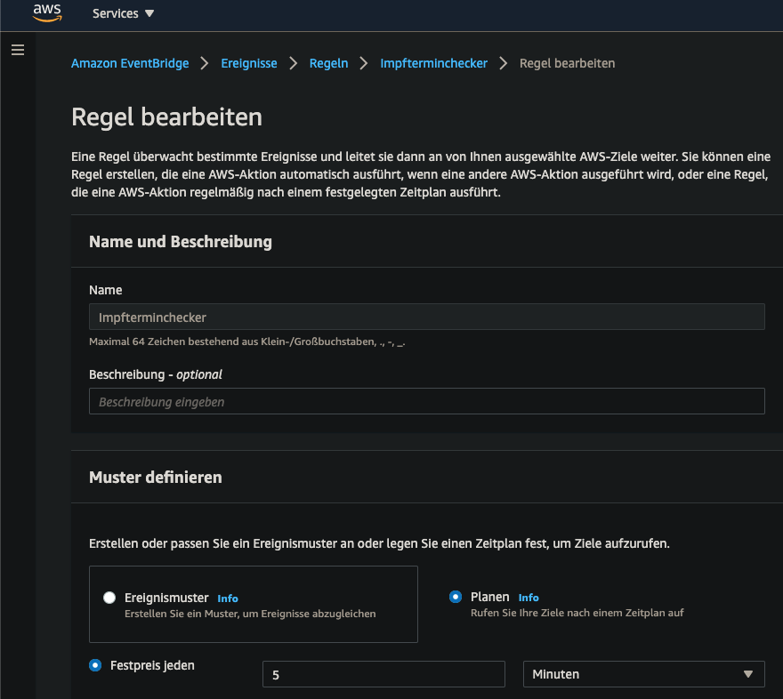
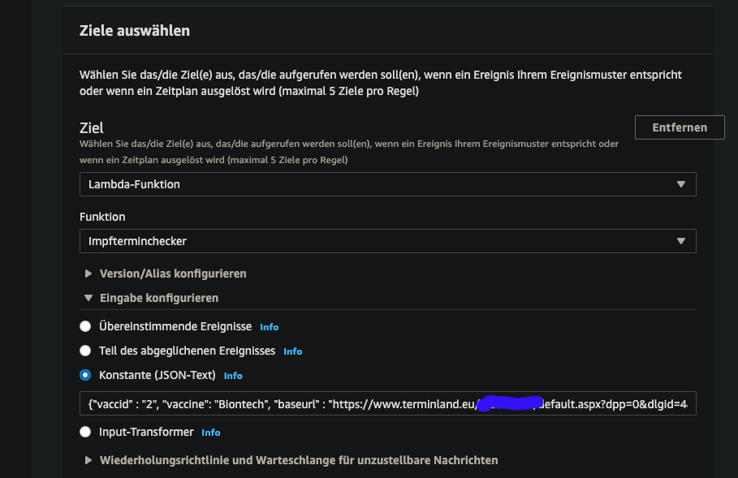
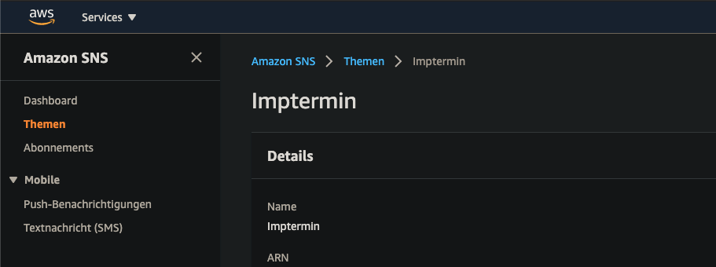

# impfterminchecker
Automatically check and notify (push) for vaccination dates offered via terminland.de

Code may be uploaded as AWS-Lambda (Python 3.x)

AWS-CloudWatchEvent Rules (time triggered) may be used for triggering the AWS-Lambda...

Static JSON to be attached to the event...

AWS-SNS will be used for notification...

