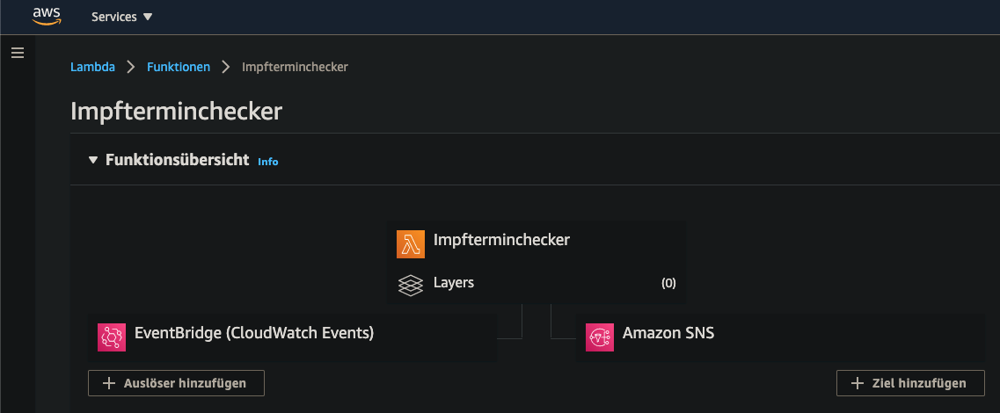
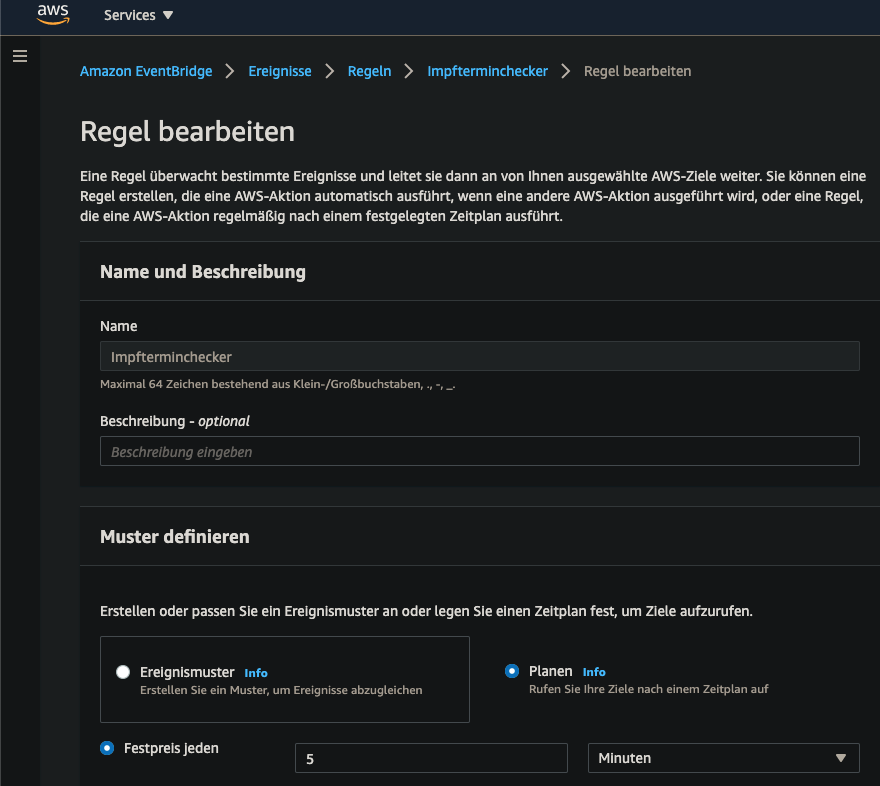
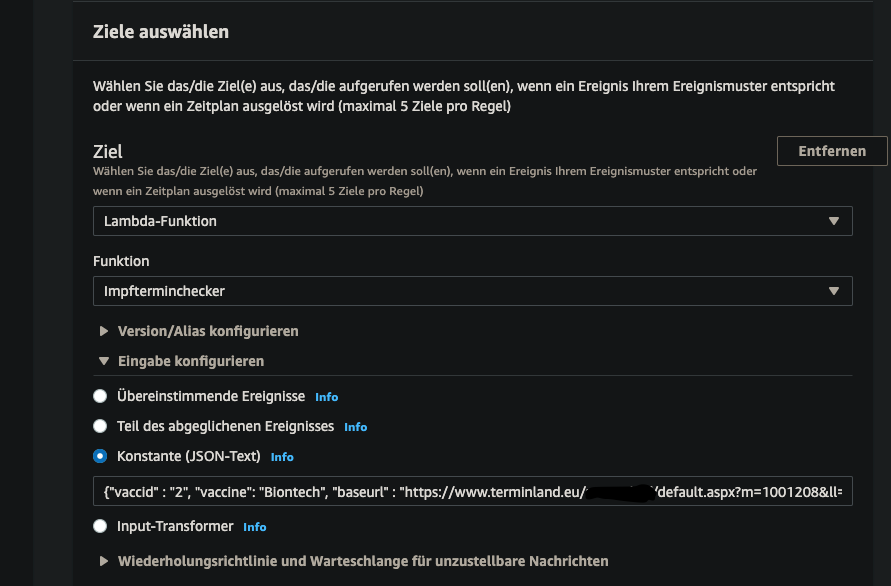

# impfterminchecker
Automatically check and notify (push) for vaccination dates offered via terminland.de

Code may be uploaded as AWS Lambda (Python 3.x)

CloudWatch Event Rules (time triggered) may be used for triggering the Lambda...

Static JSON is attached to the event...

AWS SNS will be used for notification...

